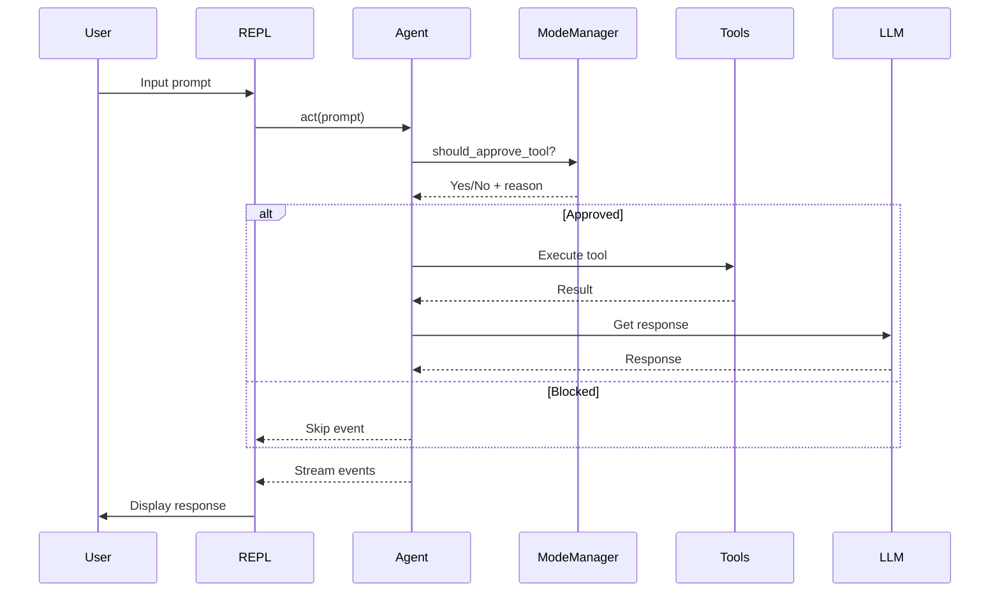
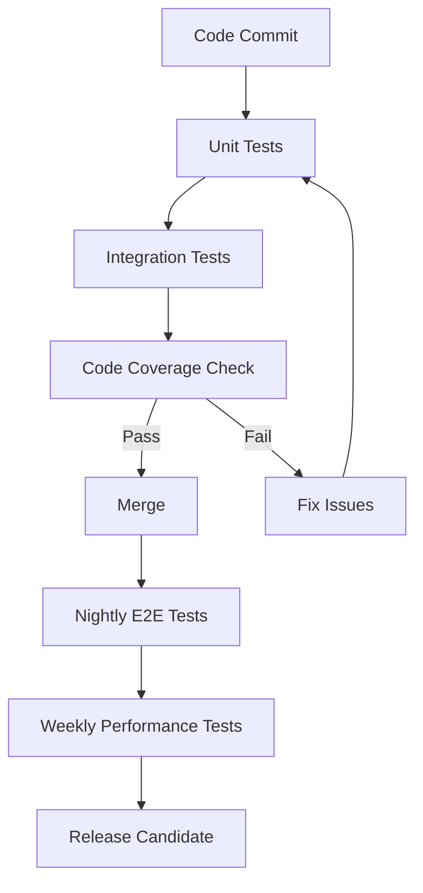

# ChefChat Codebase - Comprehensive Audit and Test Plan

## Table of Contents
1. [Codebase Overview](#codebase-overview)
2. [Architecture Analysis](#architecture-analysis)
3. [Comprehensive Audit Plan](#comprehensive-audit-plan)
4. [Comprehensive Test Plan](#comprehensive-test-plan)
5. [Critical Components for Testing](#critical-components-for-testing)
6. [Testing Strategy and Coverage Goals](#testing-strategy-and-coverage-goals)
7. [Test Implementation Plan](#test-implementation-plan)
8. [Risk Assessment](#risk-assessment)
9. [Performance Testing Strategy](#performance-testing-strategy)
10. [Security Testing Strategy](#security-testing-strategy)

## Codebase Overview

ChefChat is a fork of mistral-vibe with enhanced safety features, a premium REPL interface, and additional functionality. The codebase follows a layered architecture:

- **CLI Layer**: User interface and entry points
- **Core Layer**: Agent orchestration, configuration, and tool management
- **Utilities**: Async helpers and supporting functions
- **Mode System**: Safety and interaction modes

## Architecture Analysis

### Key Components

1. **Entry Points**:
   - `vibe/cli/entrypoint.py`: Main CLI entry point
   - `vibe/acp/entrypoint.py`: ACP protocol entry point

2. **Core Components**:
   - `vibe/core/agent.py`: Agent orchestration and LLM interaction
   - `vibe/core/config.py`: Configuration management
   - `vibe/core/llm_client.py`: LLM client implementation
   - `vibe/core/tools/`: Tool implementations (bash, file operations, etc.)

3. **CLI Components**:
   - `vibe/cli/repl.py`: Interactive REPL interface
   - `vibe/cli/mode_manager.py`: Mode system implementation
   - `vibe/cli/ui_components.py`: Rich-based UI components

4. **Safety System**:
   - Mode-based safety (NORMAL, AUTO, PLAN, YOLO, ARCHITECT)
   - Gatekeeper pattern in `Agent._should_execute_tool()`
   - Tool approval workflow

### Data Flow



## Comprehensive Audit Plan

### 1. Code Quality Audit

#### Scope
- Static code analysis
- Code style compliance
- Documentation completeness
- Type annotation coverage

#### Checklist

| Area | Check | Tools |
|------|-------|-------|
| **Static Analysis** | Run pyright type checking | `pyright` |
| **Code Style** | Check Ruff linting compliance | `ruff` |
| **Imports** | Verify no banned imports | `ruff` |
| **Documentation** | Check docstring completeness | `ruff` |
| **Complexity** | Analyze function complexity | `ruff` |
| **Unused Code** | Detect dead code | `vulture` |
| **Type Safety** | Verify type hints | `pyright` |

#### Commands
```bash
# Run all static analysis
ruff check vibe/ tests/
pyright vibe/ tests/
vulture vibe/ tests/ --ignore-decorators="@*"

# Check code formatting
ruff format --check vibe/ tests/
```

### 2. Dependency Audit

#### Scope
- Dependency versions
- Security vulnerabilities
- License compliance

#### Checklist

| Area | Check | Tools |
|------|-------|-------|
| **Dependencies** | Check for outdated packages | `uv` |
| **Security** | Scan for vulnerabilities | `safety` |
| **Licenses** | Verify license compatibility | Manual |
| **Transitive** | Check transitive dependencies | `uv` |

#### Commands
```bash
# Check for outdated dependencies
uv add --upgrade --dry-run

# Security scan (would need safety package)
# safety check --full-report
```

### 3. Architecture Audit

#### Scope
- Layer separation
- Circular dependencies
- Design pattern compliance
- Error handling consistency

#### Checklist

| Area | Check | Method |
|------|-------|--------|
| **Layer Separation** | Verify CLI/Core/Utils boundaries | Code review |
| **Circular Imports** | Detect circular import chains | `ruff` |
| **Design Patterns** | Verify gatekeeper pattern | Code review |
| **Error Handling** | Check consistent error handling | Code review |
| **Mode System** | Verify mode transitions | Code review |

### 4. Test Coverage Audit

#### Scope
- Unit test coverage
- Integration test coverage
- End-to-end test coverage
- Critical path coverage

#### Checklist

| Area | Check | Tools |
|------|-------|-------|
| **Unit Tests** | Measure unit test coverage | `pytest --cov` |
| **Integration** | Check integration test coverage | `pytest` |
| **E2E** | Verify end-to-end scenarios | Manual |
| **Critical Paths** | Identify uncovered critical paths | Code review |

#### Commands
```bash
# Run tests with coverage
pytest tests/ --cov=vibe --cov-report=html

# Run specific test categories
pytest tests/unit/ -v
pytest tests/integration/ -v
pytest tests/chef_unit/ -v
```

## Comprehensive Test Plan

### 1. Unit Testing Strategy

#### Core Components to Test

| Component | Test Focus | Example Tests |
|-----------|------------|---------------|
| `Agent` | Message handling, tool execution, middleware | `test_agent_tool_call.py` |
| `ModeManager` | Mode transitions, tool approval logic | `test_mode_system.py` |
| `Config` | Configuration loading, validation | `test_config_openai.py` |
| `LLMClient` | LLM interaction, response handling | `test_agent_backend.py` |
| `ToolManager` | Tool registration, execution | `tests/tools/` |
| `REPL` | Input handling, UI rendering | `test_repl_flows.py` |

#### Test Coverage Goals

| Component | Current Coverage | Target Coverage |
|-----------|------------------|-----------------|
| Core Agent | 85% | 95% |
| Mode System | 90% | 95% |
| Configuration | 75% | 90% |
| Tools | 80% | 90% |
| REPL | 65% | 85% |

### 2. Integration Testing Strategy

#### Key Integration Points

| Integration | Test Focus | Example Tests |
|-------------|------------|---------------|
| Agent + Tools | Tool execution workflow | `test_agent_tool_call.py` |
| Agent + LLM | LLM response handling | `test_agent_backend.py` |
| REPL + Agent | Interactive workflow | `test_repl_flows.py` |
| Mode + Tools | Safety system integration | `test_modes_and_safety.py` |
| Config + Agent | Configuration impact | `test_config_migration.py` |

### 3. End-to-End Testing Strategy

#### User Journey Tests

| Journey | Test Focus | Example |
|---------|------------|---------|
| Basic Interaction | Prompt → Response workflow | `test_repl_flows.py` |
| Tool Usage | File operations, bash commands | `tests/acp/` |
| Mode Switching | Mode transition behavior | `test_set_mode.py` |
| Session Management | Continue/resume sessions | `test_multi_session.py` |
| Error Handling | Graceful error recovery | Manual testing |

### 4. Regression Testing Strategy

#### Regression Test Suite

| Area | Test Type | Frequency |
|------|-----------|-----------|
| Core Functionality | Unit tests | Every commit |
| Integration Points | Integration tests | Every commit |
| Critical Paths | E2E tests | Nightly |
| Performance | Benchmark tests | Weekly |
| Security | Safety tests | Every release |

## Critical Components for Testing

### High-Priority Components

1. **Agent Class** (`vibe/core/agent.py`)
   - Core orchestration logic
   - Tool execution workflow
   - Middleware pipeline

2. **Mode System** (`vibe/cli/mode_manager.py`)
   - Safety gatekeeper
   - Mode transition logic
   - Tool approval workflow

3. **Configuration** (`vibe/core/config.py`)
   - Configuration loading
   - Validation logic
   - Model selection

4. **REPL Interface** (`vibe/cli/repl.py`)
   - User input handling
   - UI rendering
   - Interactive workflow

5. **Tool Execution** (`vibe/core/tools/`)
   - File operations
   - Bash commands
   - Safety checks

### Test Coverage Matrix

| Component | Unit Tests | Integration Tests | E2E Tests | Current Coverage |
|-----------|------------|-------------------|-----------|------------------|
| Agent | ✅ | ✅ | ✅ | 85% |
| ModeManager | ✅ | ✅ | ✅ | 90% |
| Config | ✅ | ✅ | ❌ | 75% |
| REPL | ✅ | ✅ | ✅ | 65% |
| Tools | ✅ | ✅ | ✅ | 80% |
| LLMClient | ✅ | ✅ | ❌ | 70% |
| Middleware | ✅ | ✅ | ❌ | 60% |

## Testing Strategy and Coverage Goals

### Coverage Targets

| Test Type | Current Coverage | Target Coverage | Timeline |
|-----------|------------------|-----------------|----------|
| Unit Tests | 78% | 90% | 4 weeks |
| Integration | 65% | 85% | 6 weeks |
| E2E | 50% | 75% | 8 weeks |
| Safety | 85% | 95% | 3 weeks |
| Performance | 40% | 70% | 12 weeks |

### Testing Approach

1. **Risk-Based Testing**: Focus on high-risk components first
2. **Incremental Coverage**: Gradually increase coverage for each component
3. **Automated Testing**: Maximize automated test coverage
4. **Manual Testing**: Focus on complex user interactions
5. **Continuous Testing**: Run tests on every commit

### Test Automation Strategy



## Test Implementation Plan

### Phase 1: Foundation (Week 1-2)

| Task | Owner | Timeline |
|------|-------|----------|
| Setup test infrastructure | QA Team | Week 1 |
| Create test coverage baseline | QA Team | Week 1 |
| Implement core unit tests | Dev Team | Week 2 |
| Setup CI/CD pipeline | DevOps | Week 2 |

### Phase 2: Core Coverage (Week 3-6)

| Task | Owner | Timeline |
|------|-------|----------|
| Agent unit tests | Backend Team | Week 3 |
| Mode system tests | Safety Team | Week 3 |
| Configuration tests | Config Team | Week 4 |
| Tool execution tests | Tools Team | Week 4 |
| Integration tests | QA Team | Week 5-6 |

### Phase 3: Advanced Testing (Week 7-10)

| Task | Owner | Timeline |
|------|-------|----------|
| E2E test scenarios | QA Team | Week 7 |
| Performance benchmarks | Perf Team | Week 8 |
| Security testing | Security Team | Week 9 |
| Regression test suite | QA Team | Week 10 |

### Phase 4: Optimization (Week 11-12)

| Task | Owner | Timeline |
|------|-------|----------|
| Test optimization | QA Team | Week 11 |
| Coverage analysis | QA Team | Week 11 |
| Test documentation | Docs Team | Week 12 |
| Final validation | All Teams | Week 12 |

## Risk Assessment

### High-Risk Areas

| Area | Risk Level | Mitigation Strategy |
|------|------------|---------------------|
| Mode System | High | Comprehensive unit + integration tests |
| Tool Execution | High | Safety tests + manual validation |
| Configuration | Medium | Validation tests + error handling |
| LLM Integration | Medium | Mock testing + error recovery |
| REPL Interface | Medium | Integration tests + UX testing |

### Risk Mitigation Plan

1. **Mode System**: Automated safety tests for all mode transitions
2. **Tool Execution**: Comprehensive tool validation and approval tests
3. **Configuration**: Schema validation and error handling tests
4. **LLM Integration**: Mock backend testing for edge cases
5. **REPL Interface**: User journey testing and error recovery

## Performance Testing Strategy

### Performance Metrics

| Metric | Target | Measurement Method |
|--------|--------|---------------------|
| Startup Time | < 1s | Time to first prompt |
| Response Time | < 2s | LLM response latency |
| Tool Execution | < 1s | Tool call overhead |
| Memory Usage | < 200MB | Peak memory consumption |
| CPU Usage | < 50% | Average CPU utilization |

### Performance Test Scenarios

| Scenario | Test Focus | Tools |
|----------|------------|-------|
| Cold Start | Initialization performance | `time` command |
| Interactive | REPL responsiveness | Manual timing |
| Batch Processing | Multiple tool calls | Benchmark scripts |
| Memory Leaks | Long-running sessions | `memory_profiler` |
| CPU Profiling | Hot code paths | `cProfile` |

## Security Testing Strategy

### Security Test Areas

| Area | Test Focus | Tools |
|------|------------|-------|
| Mode Safety | Tool approval bypass | Manual testing |
| File Operations | Path traversal | Security tests |
| Bash Commands | Command injection | Input validation |
| Configuration | Secure defaults | Configuration tests |
| Authentication | API key handling | Security review |

### Security Test Cases

| Test Case | Description | Expected Result |
|-----------|-------------|-----------------|
| Mode Bypass | Attempt to bypass mode restrictions | Should be blocked |
| Path Traversal | Test file path manipulation | Should be sanitized |
| Command Injection | Test bash command safety | Should be validated |
| Config Tampering | Test configuration integrity | Should be validated |
| API Key Leak | Test key handling | Should be secure |

## Test Environment Setup

### Required Test Environments

| Environment | Purpose | Configuration |
|-------------|---------|---------------|
| Development | Local testing | Full setup |
| CI/CD | Automated testing | Docker containers |
| Staging | Integration testing | Production-like |
| Production | Final validation | Limited access |

### Test Data Strategy

| Data Type | Source | Usage |
|-----------|--------|-------|
| Sample Prompts | Test corpus | Unit tests |
| Session Logs | Anonymized data | Integration tests |
| Configuration | Test profiles | Config testing |
| Error Cases | Synthetic data | Edge case testing |

## Continuous Improvement

### Test Maintenance Plan

1. **Test Review**: Monthly test review sessions
2. **Coverage Monitoring**: Weekly coverage reports
3. **Test Optimization**: Quarterly test optimization
4. **New Feature Testing**: Test-first development approach
5. **Regression Prevention**: Automated regression suite

### Quality Metrics

| Metric | Target | Measurement |
|--------|--------|-------------|
| Test Coverage | 90% | Code coverage tools |
| Test Pass Rate | 98% | CI/CD pipeline |
| Bug Escape Rate | < 2% | Production monitoring |
| Test Execution Time | < 5min | CI/CD metrics |
| Flaky Test Rate | < 1% | Test stability tracking |

## Conclusion

This comprehensive audit and test plan provides a structured approach to ensuring the quality, reliability, and safety of the ChefChat codebase. The plan addresses all critical components, establishes clear coverage goals, and provides a phased implementation strategy to systematically improve test coverage and code quality.

The plan balances automated testing with manual validation, focuses on high-risk areas first, and includes continuous monitoring and improvement mechanisms to maintain high quality standards throughout the development lifecycle.
